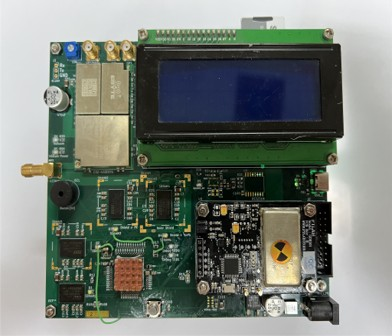

# AgisSAT Demo Board  
*Aegis Core Board – 알고리즘/하드웨어 검증용 데모 보드*

> **Status**: 메인 대회 프로젝트(Aegis Core Board)는 **Pending**, 본 데모 보드는 **완료(1차 검증용)** 및 **후속 리비전 준비 중**.  
> **Purpose**: 상용 SDRAM(COTS) 4개를 **동일 FMC 버스**에 물린 뒤, 차폐 조건을 달리하여 **SEU(비트 플립) 발생률**을 정량 비교·로깅하는 **실험 플랫폼**.

  
<!-- 권장: 조립 완료 보드 탑뷰(ESD 매트 위), 주요 블록 콜아웃 라벨 포함 -->

---

## TL;DR
- **핵심 아이디어**: **동일한 버스·접근 패턴**에서 쉴딩만 바꾼 SDRAM 4개를 비교 → **차폐 설계가 SEU에 주는 영향**을 실비행 전 단계에서 정량 검증.  
- **코어 HW**: **STM32H745XIH6** + **IS42S32160F x4**(FMC 16-bit 공유) + **외부 디코더로 칩 선택(/CS)**.  
- **통신/로그**: **LoRa 433(E32-433T37S)**, **Iridium 9602 SBD(백업)**, **USB-C FS 디버그**, **SDIO microSD** 로깅.  
- **항법/센서**: **u-blox MAX-M10S**, **BNO085**, **MS5611-01BA**, **AS6221 x4**, **DS3231M**, **INA219B**.  
- **전원**: 12V → **LM2596S-3.3 / LM2596S-5.0**, 9602 버스트 대비 대용량 벌크캡.  
- **EDA/PCB**: **KiCad 9.0.4**, **6층 데모**(비행 후보는 **≥8층**, 권장 **10–12층**).

---

## 왜 이 보드인가
1) **가설**: 적절한 차폐 구조가 적용되면 **COTS SDRAM도 임무 등급에서 쓸만한 SEU 내구성**을 가질 수 있다.  
2) **방법**: 동일 버스의 SDRAM 4개에 **서로 다른 차폐 스택**을 적용하고 **에러 발생률/패턴**을 비교.  
3) **현황**: 서브시스템 다수 **PASS**, **SDRAM은 1개(Chip#3) 안정 / 나머지 불안정** → **SI/타이밍/디코더** 3요인 동시 최적화 진행.

---

## 시스템 개요

  
<!-- 권장: OBC ⇄ SDRAM Array ⇄ Comms/Sensors ⇄ Power 블록 다이어그램 -->

### 하이라이트
- **FMC 16-bit** 공유 버스에 **SDRAM x4**, **/CS는 외부 디코더**로 개별 선택.  
- **메모리 테스트 펌웨어**: 패턴 스윕/에러맵 로깅/주파수 단계 가변.  
- **이중 텔레메트리**: LoRa 기본, Iridium 9602 백업(원격 버저/LED 제어 시나리오 포함).  
- **GPS-PPS 타임태깅** + **INA219B 전류** 로깅으로 환경 상관 분석.  
- **MS5611 어셈블리 규정**(No-Clean/No-Wash/단회 실장) 엄수.

### 주요 사양

| 항목 | 스펙 |
|---|---|
| MCU | **STM32H745XIH6** (Cortex-M7 @480 MHz, Flash 2 MB) |
| 외부 메모리 | **IS42S32160F-6BLI ×4**, 16-bit, **공유 버스** |
| 칩 선택(계획) | **SN74LVC138A** (현재 데모: **74HC138 임시 대체**) |
| 스토리지 | microSD (**SDIO 4-bit**) |
| 1차 링크 | **LoRa 433 MHz**(E32-433T37S, UART + M0/M1/AUX) |
| 2차 링크 | **Iridium 9602 SBD**, UART + HW Flow |
| 항법/센서 | **MAX-M10S**, **BNO085**, **MS5611-01BA**, **AS6221×4**, **DS3231M**, **INA219B** |
| 전원 | 12V IN → **LM2596S-3.3V / LM2596S-5.0V**, 벌크캡(9602 버스트 대응) |
| I/O/디버그 | **USB-C FS**(CC 5.1 kΩ, D± 22 Ω, TVS), **SWD 10-pin**, **20×4 CLCD**, LED |
| PCB | **6-Layer Demo**, 비행 후보: **≥8-Layer(권장 10–12-Layer)** |
| EDA | **KiCad 9.0.4** |

---

## 회로도 안내

- **Top Sheet** — USB-C UFP(CC1/CC2 5.1 kΩ), D± 22 Ω, TVS, 시트 하이어라키  
  

- **SDRAM Array** — **A/BA/CTRL/DQ/CLK 브로드캐스트**, 칩별 **/CS**, **22 Ω 댐핑 뱅크**, 로컬 디캡  
  

- **MCU** — H745, ST-LINK, 부트/클럭, **SDIO**, **I²C(BNO085/MS5611/AS6221×4/DS3231M/INA219B)**, LoRa UART, GPS UART+PPS  
  

- **Power** — 12V IN, **INA219B(0.1 Ω)**, **LM2596S-3.3/5.0**, 레일 디커플링  
  

- **Additional** — **MAX-M10S** RF/ESD/LNA_EN, **Iridium 9602**(벌크캡 배열), **Buzzer(BSS138)**  
  

> PDF를 사용한다면 `docs/schematics/*.pdf` 로 추가 후 링크하세요.

---

## SDRAM 실험 설계

### 버스 토폴로지
- **16-bit FMC** 공유: `A[0..12], BA[1:0], SDCLK, /RAS, /CAS, /WE, D[0..15], NBL[1:0]` **브로드캐스트**.  
- 각 칩은 **독립 /CS(NE)**, **선택된 칩만 `CKE=1`**, 나머지 **`CKE=0`** 로 비활성.  
- **차폐 조건 4종**을 칩별로 적용(무차폐/단층/저밀도 충진/고밀도 다층 등) → 동일 패턴·부하에서 **SEU 비교**.

### SI/타이밍 메모(데모 v1)
- 목표 **50 Ω**(층별 라인 폭/유전체 기준 산출).  
- **임계거리≈110 mm** vs **최대 라우팅 184.5 mm** → 전송선로 거동/반사 고려.  
- **22 Ω 시리즈 댐핑** 다수(특히 **CLK는 소스 근접** 배치).  
- **VREF/VDDQ** 로컬 디캡 충분히, 참조 레일 분리(비드) 권장.

---

## Bring-up 결과 (요약)

| 항목 | 상태 | 메모 |
|---|---|---|
| LCD / LED | **PASS** | 상태표시 정상 |
| AS6221 ×4 | **PASS** | 주소 0x48–0x4B |
| INA219B | **PASS** | 시스템 전류 로깅 |
| SYSCLK 480 MHz | **PASS** | 안정 |
| 내부 온도 | **PASS** | 기준 오프셋 반영 |
| USB-VCP | **PASS** | **초기 PA12(D+) 미연결 → BGA 재실장으로 해결** |
| SD Card | **PASS** | 파일시스템 오류 해결 |
| GPS(MAX-M10S) | **PASS** | PPS 입력 OK |
| Buzzer | **PASS** | 원격 트리거 예정 |
| 방사선 센서 | **PASS(값 검증 필요)** | 절대선량 교정 TBD |
| **SDRAM** | **부분 PASS** | **Chip#3 안정**, 나머지 불안정(원인: **SI/타이밍/디코더** 복합) |
| **Decoder** | **임시 동작** | **풋프린트 방향 실수** → **74HC138 점퍼 대체**, 차기 **LVC138** 교체 예정 |
| Iridium 9602 | 준비중 | 전원 피크/플로우 제어/링 신호 테스트 예정 |

---

## 제조/어셈블리 QA (필수 준수)

### MS5611-01BA (기압)
- **하부 라우팅 금지**, **압력 포트 이물질 금지**, **무세척( No-Clean ) 페이스트만**, **세척 금지**, **단회 실장**.

### GDK101 감마 센서
- 5V MCU와 인터페이스 시 **직렬 100 Ω** 필요(레벨 일치 재확인).

### 작업 체크리스트(발췌)
- [ ] 초음파 세척 가능한 부품 **선실장/세척**  
- [ ] 세척 불가 부품은 **무세척 플럭스 소량**  
- [ ] **MS5611 단회 실장** 원칙

---

## 레이아웃 & 다음 리비전 계획
- **층수**: 데모 6-Layer → 비행 후보 **≥8-Layer(권장 10–12)**.  
- **디코더**: **SN74LVC138A**(또는 **74LVC1G139×2**)로 교체, **/OE 글로벌 비활성** 지원.  
- **토폴로지**: **SDCLK 데이지·근접 시리즈 22–33 Ω**, 주소/제어 분기 최소화, DQ 바이트 레인 매칭.  
- **VREF/VDDQ**: 아날로그 분리(비드) + 로컬 디캡 확충.  
- **Iridium 전원**: **+5V 벌크 470–1000 µF** 근접, 레귤레이터 여유 30%↑, 안테나 GND 비아 스티칭 촘촘히.  
- **USB-C**: **VBUS TVS + 폴리퓨즈** 추가, 실드 RC(1 nF//1 MΩ) 접지 권장.

---

## 펌웨어/테스트(개요)
- **부팅 시퀀스**: 전원·온도·클럭 → I²C 스캔 → SD 카드 마운트 → SDRAM 1칩씩 테스트.  
- **메모리 테스트**: `0x00/0xFF/0xAA55/MARCH C-` 등 패턴, **48→84→100 MHz 단계** 증가.  
- **로그**: 에러맵(주소/비트/시간/온도/전류) **CSV**로 SD 저장, LoRa/Iridium로 요약 전송.  
- **원격 명령**: LoRa/Iridium 통해 **버저/LED**, **백업 링크 강제 스위치**, **데이터 덤프** 등.

---

## 이미지/자료 요청(리드미 배치용)
- `docs/images/hero-assembled.jpg` — 조립 완료 탑뷰(콜아웃 라벨).  
- `docs/images/block-diagram.png` — 시스템 블록 다이어그램.  
- `docs/schematics/*.png` — Top, SDRAM Array, MCU, Power, Additional 각 1장.  
- `docs/images/layout-length-map.png` — SDRAM 라우팅 길이/임계길이 시각화.  
- `docs/images/shielding-concepts.png` — 4가지 차폐 스택 개념도.  
- `docs/images/assembly-ms5611-warning.png` — MS5611 어셈블리 주의 포스터.

---

## 제작/툴체인
- **Hardware**: KiCad **9.0.4**  
- **Firmware**: STM32CubeIDE(**HAL/FreeRTOS**) 권장  
- **Debugger**: ST-LINK V2-1 / SWD-10pin

---

## 나의 기여(대학원 제출용 요약)
- **OBC/SDRAM 아키텍처·회로·PCB** 총괄, **SI 가이드/임계거리/댐핑 전략** 수립.  
- **외부 디코더 기반 /CS 분기** 구조 설계 및 **풋프린트 오류→임시 74HC138 대체/복구**.  
- **Bring-up/디버깅**: USB-VCP(미연결 D+ 재실장), SD 카드 FS 이슈 해결, **SDRAM 부분 안정화**.  
- **실험 프레임워크**: **에러맵 로깅 파이프라인**(센서/전류/시간 동시 기록) 정의.  
- **운용 시나리오**: LoRa/Iridium 이중 링크, **원격 버저/LED/데이터 덤프** 설계.

---

## 로드맵
- [ ] **SN74LVC138A 교체** + /OE 제어 반영, CKE/NE 시퀀스 재설계  
- [ ] **FMC 타이밍 튜닝 프로파일**(48/84/100 MHz) + 자동화 메모리 테스트 툴  
- [ ] **Iridium TX 전원 테스트**(5 V droop/온도/전류 파형)  
- [ ] **차폐 4조건** 실제 시편 장착/질량·부피·비용 테이블화  
- [ ] **필드 리허설**: 로그 수집/후처리 스크립트 공개

---

## 라이선스 & 문의
- 라이선스: 추후 명시(예: CERN-OHL-S 또는 MIT)  
- 문의: 이슈 트래커 또는 이메일 기재

