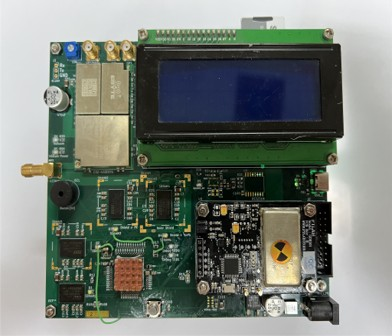
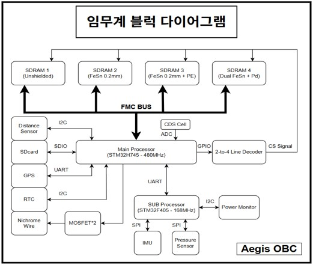
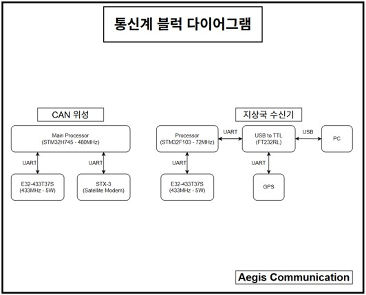
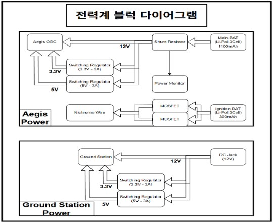
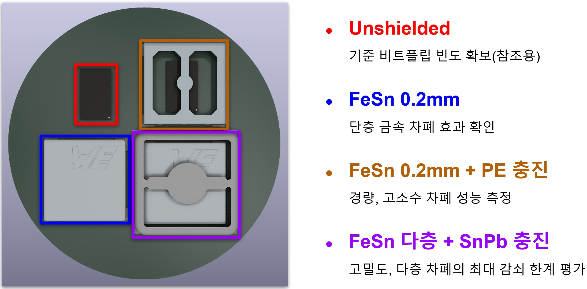

# AgisSAT Demo Board  
*Aegis Core Board의 알고리즘/하드웨어 검증용 데모 보드*

> **Status**: Main(대회용) 보드 주제 변경으로 **보류(Pending)**. 본 저장소는 **데모 보드 기반 사실 기록과 재현 가능한 검증 절차**를 제공합니다.

<!-- 권장 사진: 조립 완료 탑뷰(ESD 매트 위), 주요 블록 콜아웃 포함 -->

---

## 1) 개요

AgisSAT Demo Board는 COTS SDRAM 4개를 **동일 FMC 버스**에 연결하고, **차폐 조건만 다르게** 적용하여 **SEU(비트 플립) 발생 특성**을 정량 비교하기 위한 검증 플랫폼입니다. LoRa(433 MHz)와 Iridium SBD(백업)를 통해 **실시간 텔레메트리/원격 제어**가 가능하며, microSD로 **에러맵 및 환경 로그**를 저장합니다.

**핵심 구성**
- **MCU**: STM32H745XIH6 (Cortex-M7 @480 MHz, Flash 2 MB)
- **SDRAM**: IS42S32160F-6BLI ×4 (FMC 32-bit 공유 버스, 칩별 /CS)
- **디코더**: SN74LVC138A 계획(데모 임시: 74HC138 점퍼 대체)
- **저장/디버그**: SDIO microSD, USB-C FS(VCP), SWD 10-pin
- **통신**: LoRa 433 MHz (E32-433T37S), Iridium 9602 SBD(백업)
- **항법/센서**: MAX-M10S(GPS, PPS), BNO085(IMU), MS5611-01BA(Baro), AS6221×4(Temp), DS3231M(RTC), INA219B(Current)
- **전원**: 12 Vin → LM2596S-3.3 / LM2596S-5.0 (Iridium 버스트 대응 벌크캡)

<h3>Block Diagrams</h3>
<table>
  <tr>
    <td></td>
    <td></td>
    <td></td>
  </tr>
  <tr>
    <td align="center">OBC</td>
    <td align="center">Communication</td>
    <td align="center">Power</td>
  </tr>
</table>

---

## 2) 하드웨어 한눈에 보기

| 항목 | 내용 |
|---|---|
| MCU | STM32H745XIH6, HSE, SWD, 부트/클럭 스트랩 |
| 외부 메모리 | IS42S32160F ×4, A/BA/CTRL/DQ/CLK 브로드캐스트, 칩별 /CS |
| /CS 분기 | 외부 3→8 디코더(권장: SN74LVC138A, 임시: 74HC138 점퍼) |
| 저장장치 | microSD (SDIO 4-bit), 파일 롤링/로그 |
| 유선 디버그 | USB-C FS(UFP, CC 5.1 kΩ, D± 22 Ω, ESD TVS), VCP |
| 무선/백업 | LoRa 433 MHz(UART+M0/M1/AUX), Iridium 9602(UART+HW Flow) |
| 센싱 | GPS(MAX-M10S, PPS), IMU(BNO085), Baro(MS5611), Temp(AS6221×4), RTC(DS3231M), Current(INA219B) |
| 전원 | 12 V 입력 → LM2596S-3.3/5.0, 벌크캡(bank) |
| PCB | 6-Layer(데모). 차기: ≥8-Layer(권장 10–12) |
| EDA | KiCad 9.0.4 |

**SDRAM 버스 토폴로지**
- `A[0..12], BA[1:0], SDCLK, /RAS, /CAS, /WE, D[0..15], NBL[1:0]` **브로드캐스트**
- 칩별 **/CS(NEx)** 외부 디코더로 선택, **활성 칩만 `CKE=1`** (그 외 `CKE=0`)

---

## 3) 차폐 설계 (Shielding Stacks)

  

> 동일한 SDRAM 4개에 서로 다른 차폐 조건을 적용하고, **동일 FMC 버스·동일 접근 패턴**에서 **SEU(비트 플립) 발생률**을 비교합니다.  
> 결과 평가는 차폐 효율 지표 **η = 1 − (E_shield / E_bare)** 로 산출합니다.

| 조건 | 의도 | 구성(예) | 비고 |
|---|---|---|---|
| **Unshielded** | 기준선(Baseline) 확보 | 차폐 없음 | 비트플립 빈도 참조용 |
| **FeSn 0.2 mm** | 금속 단층 효과 확인 | FeSn 0.2 mm 케이지 | 경량·제작 용이 |
| **FeSn 0.2 mm + PE 충진** | 고수소 재료의 2차 방사선 저감 | FeSn 0.2 mm + **PE**(폴리에틸렌) 충진 | 경량 대비 효과 기대 |
| **FeSn 다층 + SnPb 충진** | 고밀도·다층 구조의 상한 성능 확인 | FeSn 다층 + **SnPb** 충진 | 무게↑, 최대 저감 한계 평가 |

**테스트 로그**  
- 칩별 동일 패턴(`0x00/0xFF/0xAA55/MARCH C-`)·동일 부하·동일 시간으로 측정  
- 환경 변수 동시 로깅: **온도(AS6221×4), 기압(MS5611), 전류(INA219B), GPS-PPS**  
- 결과 저장: `/logs/YYYYMMDD/sdram_map_ch{1..4}_<freq>.csv` (주소/비트/타임스탬프)

---

## 4) Bring-up Result(Demo Board)

| 기능 | 상태 | 비고 |
|---|---|---|
| LCD / LED | PASS | 상태 표시 정상 |
| AS6221 ×4 | PASS | 주소 0x48–0x4B |
| INA219B | PASS | 시스템 전류 로깅 |
| SYSCLK 480 MHz | PASS | 안정 |
| 내부 온도 | PASS | 기준 오프셋 반영 |
| USB-VCP | PASS | **초기 PA12(D+) 미연결 → BGA 재실장으로 해결** |
| SD Card | PASS | 초기 FS 오류 해소 |
| GPS(MAX-M10S) | PASS | PPS 입력 정상 |
| Buzzer | PASS | 원격 트리거 예정 |
| 방사선 센서 | PASS(재현 검증 진행) | 절대선량 교정 필요 |
| **SDRAM** | **부분 PASS** | **Chip#3 안정**, 그 외 불안정(원인 후보: **SI/타이밍/디코더**) |
| **/CS 디코더** | 임시 동작 | 풋프린트 방향 오류 → **74HC138 점퍼 대체**. 차기 **LVC138** 교체 예정 |
| Iridium 9602 | 준비중 | 전원 버스트/플로우 제어/링 신호 테스트 예정 |

---

## 5) SDRAM 안정화 전략

**관찰 요약**
- 상승시간 2.095 ns 기준 **임계거리 ≈ 110 mm**  
- 최대 라우팅 길이 **~184.5 mm**(일부 네트) → 전송선로 거동 고려 필요
- 다수 라인에 **22 Ω 시리즈 댐핑** 적용(특히 **SDCLK 소스 근접 배치**)
- VREF/VDDQ 로컬 디캡 충분히 배치(분리 비드 권장)

**권장 절차**
1. **1칩씩 테스트**: `ALL_CKE=0` → 대상 칩만 `CS=0, CKE=1`  
2. **패턴**: `0x00/0xFF/0xAA55/MARCH C-` + 갈등 패턴  
3. **클럭 단계**: 48 → 84 → 100 MHz, **CL=3**, 여유 tRCD/tRP/tWR  
4. **에러맵 로깅**: 주소/비트/시간/온도/전류 → CSV/LoRa 요약 송신

---

## 6) 펌웨어·시험

1. **부팅 셀프체크**: 전원/온도/클럭 → I²C 스캔 → SD 마운트  
2. **메모리 시험**: 칩별 활성 → 패턴 스윕 → 주파수 단계 증가  
3. **로그**: `/logs/YYYYMMDD/*.csv` (에러맵 및 환경)  
4. **원격 제어**: LoRa 기본, 실패 시 Iridium 백업(버저/LED/데이터 덤프)

---

## 7) 저장소 구조
<pre>
agissat-hw-2025/
├─ hw/                 # KiCad 원본, 스택업/임피던스 메모
├─ docs/
│  ├─ images/          # 사진/다이어그램
│  ├─ schematics/      # 시트별 PNG/PDF
│  └─ Ref              # 설계시 참고 문
└─ README.md
</pre>
